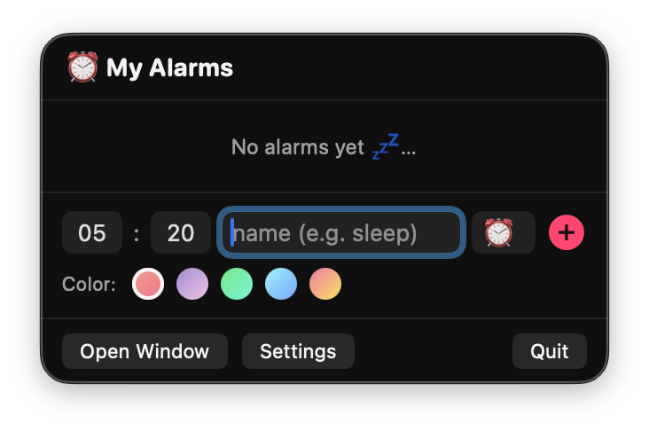
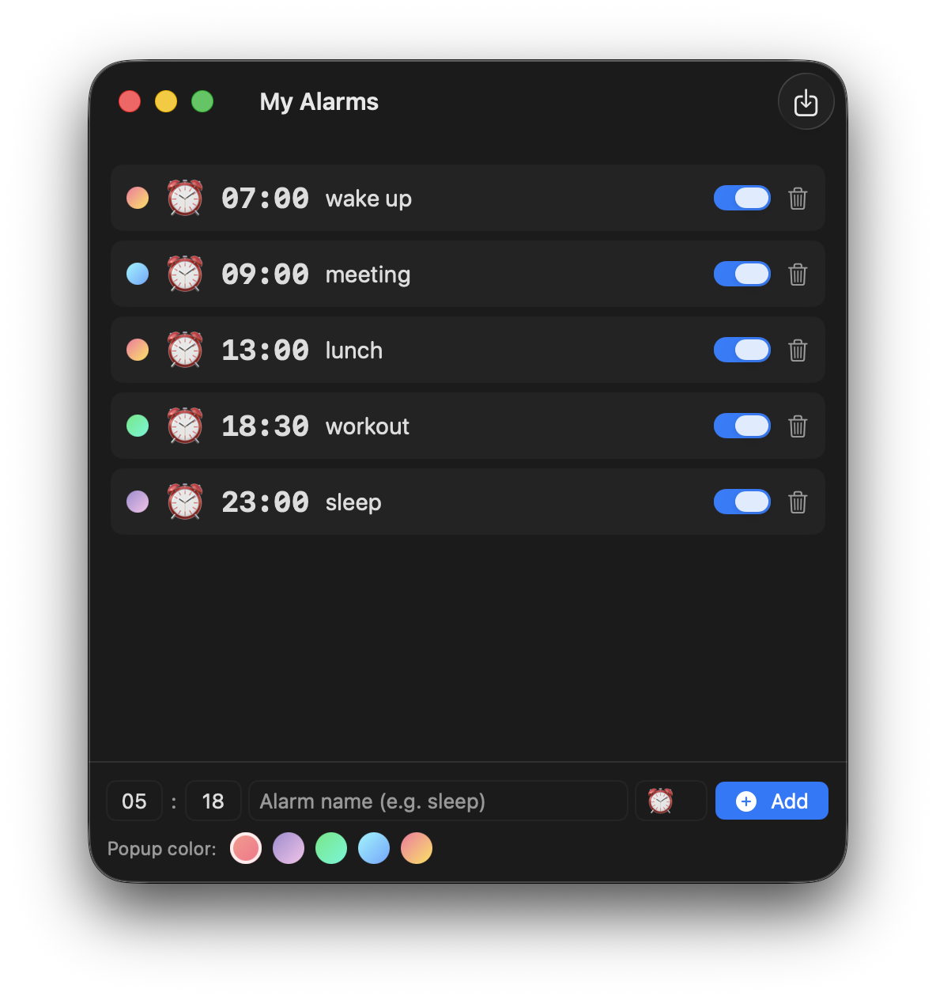

<h1 align="center">Reminder for Mac ⏰</h1>

<p align="center">
  A lightweight macOS menu bar app for gentle daily reminders — with cute, colorful pop-ups.
</p>

<p align="center">
  
  
  
</p>

---

Click the ⏰ icon in the menu bar to add a reminder in seconds — type a time, give it a name, pick a color, and hit **Add**.

<p align="center">
  
</p>
<p align="center"><sub><em>Quick-add panel from the menu bar</em></sub></p>

Need more room? Open the full window to manage everything at once — see your whole list, toggle reminders on and off, or import them from a JSON file.

<p align="center">
  
</p>
<p align="center"><sub><em>Main window with your full reminder list</em></sub></p>

## Features

- **One-shot reminders** — enter a time and name like `23:00 sleep`; it fires once at that time, then disables itself.
- **Custom pop-up** — slides into the bottom-right corner with your choice of animation (slide / bounce / fade), a pastel gradient theme, and an emoji.
- **Per-reminder color** — pick a color for each reminder; the picker resets to your default (set in Settings) after every add.
- **Menu bar + window** — a quick-add panel from the ⏰ icon, plus a full window for detailed management.
- **Keyboard-friendly** — Tab through every field and control; typing two digits auto-advances to the next box.
- **Global hotkey** — toggle the menu panel from anywhere with `⌥⌘A` (customizable).
- **Runs 24/7** — optionally launches at login; reminders missed while the Mac was asleep are shown as soon as it wakes.
- **Readable JSON storage** — reminders live in a plain, hand-editable JSON file, with bulk import support.

## Requirements

- macOS 14 (Sonoma) or later
- Xcode Command Line Tools (`xcode-select --install`) — no full Xcode required

## Build and run

```bash
./build_app.sh
open ReminderForMac.app
```

`build_app.sh` compiles the Swift package, wraps the binary into a `ReminderForMac.app` bundle, and ad-hoc signs it. The app has no Dock icon — it lives in the menu bar. Use the **Quit** button in its panel to exit.

## Usage

**Add a reminder** — set the hour and minute, type a name and (optional) emoji, choose a color, and press **Add** (or `Return`).

**Keyboard shortcuts**

| Action | Shortcut |
| --- | --- |
| Toggle the menu panel (from anywhere) | `⌥⌘A` |
| Move between fields and controls | `Tab` / `Shift+Tab` |
| Add the reminder | `Return` |
| Close the panel | `Esc` |

**Import from JSON** — open the window and click **Import JSON** to bulk-load reminders. See [`sample_reminders.json`](sample_reminders.json) for an example.

## JSON format

```json
[
  { "time": "23:00", "name": "sleep", "emoji": "😴", "theme": "lavender" },
  { "time": "08:30", "name": "workout" }
]
```

`emoji` and `theme` are optional (`peach`, `lavender`, `mint`, `sky`, `sunset`). A `{ "reminders": [...] }` wrapper is also accepted.

## Where your data lives

Reminders and settings are stored as readable JSON — safe to edit by hand:

```
~/Library/Application Support/ReminderForMac/reminders.json
~/Library/Application Support/ReminderForMac/settings.json
```

## License

Released under the [MIT License](LICENSE).
